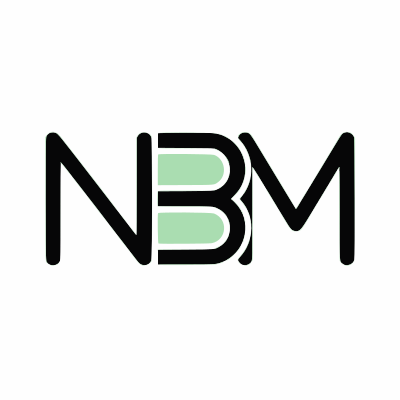

# 🚀 NotionbyMat - Notion Templates Website

Un site moderne et élégant pour vendre des templates Notion, avec système de blog intégré et support multilingue (FR/EN).



## ✨ Fonctionnalités

- 🎨 **Design Moderne** : Interface élégante avec glassmorphism et dégradés
- 🌍 **Multilingue** : Support complet Français/Anglais
- 🛍️ **Boutique de Templates** : Système de cartes dynamiques avec filtres
- 📝 **Blog Dynamique** : Articles multilingues avec rendu automatique
- 🔍 **SEO Optimisé** : Meta tags OpenGraph et Twitter Card
- 📱 **Responsive** : Adapté à tous les écrans
- ⚡ **Performance** : Code optimisé et lazy loading

## 📁 Structure du Projet

```
NotionByMat/
├── index.html              # Page d'accueil
├── templates.html          # Page catalogue templates
├── blog.html               # Page blog
├── style.css               # Styles globaux
├── script.js               # Logique principale
├── data.js                 # Données des templates
├── blogData.js             # Données des articles
├── translations.js         # Traductions FR/EN
└── images/                 # Assets visuels
    ├── logo.svg
    └── templates/
```

## 🚀 Installation

1. **Cloner ou télécharger** le projet
2. **Ouvrir** `index.html` dans un navigateur
3. Aucune installation requise ! Le site est 100% statique.

## 📝 Ajouter un Template

Éditer `data.js` et ajouter un objet dans le tableau `templatesData` :

```javascript
{
  id: 5,
  category: "productivity",
  title: "Mon Nouveau Template",
  description: "Description courte",
  coverImage: "images/templates/montemplate/cover.png",
  gallery: ["image1.png", "image2.png"],
  emoji: "🎯",
  isBestSeller: false,
  price: 0,     // Prix version gratuite
  pricePro: 29, // Prix version PRO
  promoPrice: 19, // Prix promo (optionnel)
  soldCount: 50,
  rating: 4.8,
  useCases: ["Freelances", "Entrepreneurs"],
  videoUrl: "", // URL YouTube/Vimeo (optionnel)
  links: {
    fr: { free: "lien-gumroad-fr", pro: "lien-gumroad-pro-fr" },
    en: { free: "lien-gumroad-en", pro: "lien-gumroad-pro-en" }
  },
  features: {
    fr: ["Fonctionnalité 1", "Fonctionnalité 2"],
    en: ["Feature 1", "Feature 2"]
  },
  proFeatures: {
    fr: ["Feature PRO 1", "Feature PRO 2"],
    en: ["PRO Feature 1", "PRO Feature 2"]
  }
}
```

## 📰 Ajouter un Article de Blog

Éditer `blogData.js` et ajouter un article :

```javascript
{
  id: 7,
  title: {
    en: "My Article Title",
    fr: "Titre de mon Article"
  },
  excerpt: {
    en: "Short description...",
    fr: "Description courte..."
  },
  date: "2026-01-14",
  image: "images/blog/article.jpg",
  slug: "my-article-slug",
  content: {
    en: "https://link-to-full-article-en",
    fr: "https://link-to-full-article-fr"
  }
}
```

## 🌍 Ajouter une Traduction

Éditer `translations.js` et ajouter vos clés dans les objets `en` et `fr` :

```javascript
const translations = {
  en: {
    "my.new.key": "English text",
    // ...
  },
  fr: {
    "my.new.key": "Texte français",
    // ...
  }
};
```

Utiliser dans le HTML :
```html
<p data-i18n="my.new.key">Texte par défaut</p>
```

## 🎨 Personnalisation des Couleurs

Modifier les variables CSS dans `style.css` :

```css
:root {
  --color-primary: #10B981;        /* Vert principal */
  --color-primary-dark: #047857;   /* Vert foncé */
  --color-primary-light: #ECFDF5;  /* Vert clair */
  --color-secondary: #064E3B;      /* Couleur secondaire */
  /* ... */
}
```

## 📊 SEO

Les meta tags sont configurés dans chaque page HTML. Pour personnaliser :

1. Modifier les balises `<meta>` dans le `<head>`
2. Remplacer `https://notionbymat.com` par votre domaine
3. Créer une image `og-image.jpg` dans `/images/` (1200x630px recommandé)

## 🔧 Technologies Utilisées

- **HTML5** : Structure sémantique
- **CSS3** : Variables CSS, Flexbox, Grid
- **Vanilla JavaScript** : Aucune dépendance
- **Google Fonts** : Plus Jakarta Sans

## 📱 Responsive Design

Le site s'adapte automatiquement à :
- 📱 Mobile (< 768px)
- 📱 Tablette (768px - 1200px)
- 💻 Desktop (> 1200px)

## 🚀 Déploiement

### GitHub Pages
1. Pousser le code sur GitHub
2. Activer GitHub Pages dans les paramètres
3. Sélectionner la branche `main` et le dossier `/`

### Netlify / Vercel
1. Connecter votre repo GitHub
2. Déploiement automatique à chaque commit

### FTP
1. Uploader tous les fichiers sur votre serveur
2. Pointer votre domaine vers le répertoire

## 📄 Licence

© 2026 NotionbyMat. Tous droits réservés.

## 🤝 Support

Pour toute question : notionbymat@gmail.com

---

**Fait avec 🤍 par Mat**
